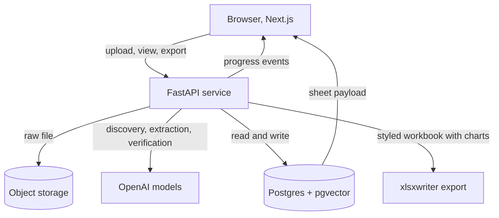

# Build Plan: IB Desk

This document is the source of truth for the build, the blueprint. Keep it in the repo root next to `CLAUDE.md`. The companion file `CLAUDE.md` holds the principles and conventions. Each phase below has an acceptance bar. Do not advance until it is met.

## What we are building

A user uploads a research document about anything: a company, a market, a person, a technology, or a deal. IB Desk understands what the document is about, discovers the right structure for it, extracts as much grounded data as possible, including well-summarized qualitative insight, and renders it as one clean, dynamic spreadsheet. The user downloads a styled, editable xlsx that looks as good as the screen. One sheet is created per document. Documents are never merged.

## Core design principles

1. The schema is discovered, not hardcoded. The code never assumes the document is about a company.
2. Content determinism. The same document must yield the same set of relevant data and the same values across runs. Section ordering and visual positioning may vary. The data and values may not.
3. Exhaustive and general. Capture everything useful, structured or qualitative. Important narrative is summarized into clean insight sections, not dropped because it is not a number.
4. Every extracted value is grounded: it carries the exact source sentence, a character span into the source text, and a confidence score. If it is not supported by the source, it does not appear.
5. Never fabricate. When support is weak, omit or flag with low confidence. A single invented figure destroys trust.
6. One document maps to exactly one sheet. No cross-document merging.
7. Export fidelity is achieved server-side, where cell styling and native charts are possible.
8. Storage is generic and tidy. The user interface and the export are derived from the stored schema, not the other way around.

## Tech stack

Web app: Next.js with TypeScript, React, Tailwind for layout, a data grid (TanStack Table headless, or a custom grid), recharts for in-app charts.
Extraction service: Python, FastAPI, async. Talks to OpenAI for discovery, extraction, verification. Generates exports with xlsxwriter.
Database: Supabase Postgres. pgvector column reserved on documents for future similar-sheet search, forward looking, not load bearing in v1.
Object storage: Supabase Storage or S3 for raw uploaded files.
Deploy: web on Vercel, service on Railway or Fly, database on Supabase.
Models: a flagship OpenAI reasoning model for discovery and extraction, a cheaper model for verification. Exact model strings to be confirmed by the project owner. Use structured outputs (JSON schema or function calling) for every call so JSON is reliable.

## Architecture



## Data model (generic, schema-agnostic)

The schema discovered for each document is stored as data in `sections` and `cells`. No table is named after a business concept.

```sql
create table documents (
  id uuid primary key default gen_random_uuid(),
  workspace_id uuid not null,
  name text not null,
  source_kind text not null,            -- upload_pdf | upload_docx | paste
  raw_text text not null,               -- normalized plain text
  byte_path text,                       -- object storage key for the original file
  doc_type text,                        -- discovered: company_profile | market_overview | deal | person | technology | other
  primary_topic text,                   -- discovered, free text
  page_count int,                       -- Phase 1: parsed page count, null for pasted text
  page_offsets jsonb,                   -- Phase 1: per-page character offsets into raw_text
  embedding vector(1536),               -- reserved for future similar-sheet search
  created_at timestamptz default now()
);

create table sheets (
  id uuid primary key default gen_random_uuid(),
  document_id uuid not null references documents(id) unique,
  title text not null,                  -- usually the primary subject label
  status text not null default 'idle',  -- idle | extracting | done | failed
  field_count int default 0,
  cost_usd numeric default 0,
  created_at timestamptz default now()
);

create table sections (
  id uuid primary key default gen_random_uuid(),
  sheet_id uuid not null references sheets(id) on delete cascade,
  key text not null,                    -- machine key, e.g. investors_capital
  label text not null,                  -- human label, e.g. Investors and capital
  kind text not null,                   -- scalar | list | table | timeseries | longtext
  render_hint text not null,            -- see RenderHint enum below
  category text,                        -- soft color category for the UI and export
  columns jsonb,                        -- for table or timeseries: ordered column defs
  sort int not null,
  confidence real
);

create table cells (
  id uuid primary key default gen_random_uuid(),
  section_id uuid not null references sections(id) on delete cascade,
  row_idx int not null default 0,
  col_key text,                         -- null for scalar and longtext
  value_raw text,                       -- exactly as written in the document
  value_norm text,                      -- normalized (number, percent, currency)
  unit text,                            -- e.g. INR, percent
  period text,                          -- e.g. FY24
  source_snippet text not null,         -- the sentence that supports this value
  char_start int,                       -- span into documents.raw_text for highlighting
  char_end int,
  confidence real
);

create table extraction_events (
  id uuid primary key default gen_random_uuid(),
  sheet_id uuid not null references sheets(id) on delete cascade,
  stage text not null,                  -- discovery | extraction | section | verification | typing | done | error
  message text,
  payload jsonb,
  created_at timestamptz default now()
);
```

Row level security on `documents`, `sheets`, `sections`, `cells` scoped by workspace. This matters later because the data is finance research.

Phase 1 note. Migration `0002_document_metadata.sql` adds two nullable columns to `documents`: `page_count int` and `page_offsets jsonb`. They are recorded at ingestion because the information is cheap to capture then and expensive to reconstruct later. `page_count` is the parsed page count and is null for pasted text where pages do not apply. `page_offsets` holds one character offset per page into `raw_text`, so a later phase can map a grounded character span back to its source page. Both columns are nullable and are written by `POST /v1/documents`; migrations are idempotent and applied in sorted file order, so all of `db/migrations/*.sql` run on a fresh and on an existing database.

## Extraction contracts

Pass 1, discovery. Input: full `raw_text`. Output:

```json
{
  "doc_type": "company_profile",
  "primary_topic": "Meridian Freight Systems, a cloud TMS vendor",
  "primary_subject": {
    "label": "Meridian Freight Systems",
    "identity_fields": [
      { "key": "founded", "label": "Founded", "value": "2017", "source": "...", "confidence": 0.95 }
    ]
  },
  "sections": [
    {
      "key": "investors_capital",
      "label": "Investors and capital",
      "kind": "table",
      "render_hint": "table",
      "category": "capital",
      "columns": [
        { "key": "name", "label": "Investor" },
        { "key": "round", "label": "Round" },
        { "key": "amount", "label": "Amount" }
      ],
      "rationale": "the document names multiple investors with rounds and ticket sizes"
    }
  ]
}
```

Pass 2, extraction, run once per section in parallel. Input: `raw_text` plus one section definition. Output:

```json
{
  "section_key": "investors_capital",
  "rows": [
    {
      "row_idx": 0,
      "cells": [
        { "col_key": "name", "value_raw": "Elevation Capital", "value_norm": "Elevation Capital", "source_snippet": "In 2023 Meridian closed a Series B led by Elevation Capital.", "char_start": 4120, "char_end": 4188, "confidence": 0.95 },
        { "col_key": "amount", "value_raw": "$24M", "value_norm": "24000000", "unit": "USD", "period": "2023", "source_snippet": "...closed a 24 million dollar Series B...", "char_start": 4090, "char_end": 4140, "confidence": 0.92 }
      ]
    }
  ]
}
```

Phase 2 note on offsets. The character offsets `char_start` and `char_end` are service-computed, not model-reported. The model returns a value and a verbatim supporting sentence only; it never reports offsets. The grounding step in the service locates that supporting sentence inside `documents.raw_text` and computes `char_start` and `char_end` from where it actually occurs. A value whose supporting sentence cannot be located in the source is ungrounded and is dropped. The example offsets shown in the extraction contract above are illustrative of the stored shape; in the running engine those numbers come from the service, not from the model. The `value_norm` field is likewise computed deterministically by the service, not by the model. This is the cardinal anti-fabrication mechanism and it is unchanged in this build: a value with no locatable source sentence does not appear.

Phase 3 note on scalar field labels (extraction prompt v2). For a scalar section, each value carries a `col_key` that is a short, human-readable field label naming what the value is, drawn from how the document presents it (for example "Roll number" or "Date of birth"). Without it, a scalar section renders as an unlabeled "Row 1, Row 2" list because the keyvalue UI has nothing to name each value with. The label is organizational and must stay faithful to the source; it is not a value and does not weaken grounding, since the value itself is still tied to its verbatim supporting sentence. Tabular sections continue to use their declared columns as `col_key`, and longtext sections leave `col_key` null. This is a live-extraction behavior only: it takes effect when a document is re-extracted, and the secret-free replay cassette gates are unaffected because they load recorded responses verbatim.

Pass 3, verification. For each cell, confirm the `source_snippet` actually supports `value_raw`. Drop or flag cells that fail. Can be a cheaper model or a rule plus model hybrid. Records a `fabrication_flag` where grounding is weak.

Pass 4, render typing. Assign each section a `render_hint`:

```
RenderHint =
  keyvalue       // scalar fields shown as label and value
  chips          // a flat list of short entities
  table          // rows and columns
  timeseries_bar // numeric values across periods, bar chart plus table
  timeseries_line// numeric values across periods, line chart plus table
  breakdown_pie  // parts of a whole, pie chart plus table
  longtext       // a summary paragraph
```

Chart rule: only emit a chart hint when a section is numeric and temporal, or a parts-of-whole breakdown with at least three points. Otherwise no chart. This avoids misleading auto-charts. The user can toggle a chart off in the UI.

## API contract

```
POST /v1/documents              multipart file or pasted text -> { document_id, sheet_id }
GET  /v1/documents              -> list of documents for the workspace (most recent first)
GET  /v1/documents/{id}         -> one document detail, including raw_text and page metadata
GET  /v1/documents/{id}/original-> stream the stored original bytes with a type from source_kind
GET  /v1/sheets/{id}            -> full payload: sheet, sections, cells, source spans
POST /v1/sheets/{id}/extract    -> starts the pipeline, returns immediately
GET  /v1/sheets/{id}/events     -> server sent events stream of extraction_events
GET  /v1/sheets/{id}/export     -> ?format=xlsx (default) | csv (pdf optional), returns the styled file
```

Phase 1 endpoints. `POST /v1/documents` validates before storing (empty input -> 400 empty_input, oversized file -> 413 file_too_large, unsupported type -> 415 unsupported_type, parse error -> 422 parse_failed, scanned or unreadable -> 422 scanned_or_unreadable) so neither the database nor object storage holds empty documents. Errors use the body shape `{ "detail": { "code", "message" } }`. `GET /v1/documents` returns the lightweight `DocumentListItem` and never includes `raw_text`. `GET /v1/documents/{id}` returns the full `DocumentDetail` including `raw_text`, `page_count`, `sheet_id`, and `sheet_status`, and 404 if not found. `GET /v1/documents/{id}/original` streams the stored bytes with a content type derived from `source_kind`: `upload_pdf` is `application/pdf`, `upload_docx` is the OpenXML wordprocessing type, and `paste` is `text/plain; charset=utf-8`; it returns 404 when the document or its `byte_path` is missing. The `{id}` path parameter is typed as a UUID, so a malformed id is a 422 rather than a 500.

Phase 4 endpoint. `GET /v1/sheets/{id}/export` returns the export as an attachment with a sanitized filename from the sheet title. `?format=xlsx` (default) returns the styled, section-organized workbook with native charts and source-sentence comments; `?format=csv` returns the flat secondary format; an unknown format is a 400 and an absent sheet is a 404. The export is computed from the stored sheet payload (the same assembly the read path uses), so it needs no model call. The canonical document text used for the in-document evidence highlight is already exposed by `GET /v1/documents/{id}` (`raw_text`) from Phase 1; the web sheet view passes that text to the evidence drawer, so no new endpoint was needed for it.

Progress streaming uses SSE from FastAPI, or Supabase Realtime on `extraction_events`. The UI shows the gradual reveal off these events. As of Phase 3 the pipeline also writes a `section` event as each section finishes extraction (after grounding, before verification and typing), carrying `{ key, label, sort, kind, cell_count }` in its payload. This is a progress signal only: the section's grounded values are read from the `GET /v1/sheets/{id}` payload once the run reaches `done`, since persistence is atomic at the end of the run. The reveal therefore shows discovered section skeletons after the `discovery` event, settles each skeleton as its `section` event arrives, and fades in the final values on `done`. It degrades gracefully to a coarser pass-level reveal when only `discovery`, `extraction`, and `done` events are seen. The primary-subject header is built from persisted, always-available data (the document `primary_topic` and `doc_type` plus the sheet `title` and counts), not from the discovery `primary_subject.identity_fields`, which are not persisted; per-subject identity facts surface as ordinary discovered sections, which keeps the header schema-agnostic.

## The extraction pipeline in detail

Synchronous for documents that fit in the model context, which covers the 20 to 40 page research docs in scope. For larger documents, add a chunk and merge fallback in Phase 5.

- Discovery: one call, low temperature, structured output. Keep a soft taxonomy of common section types in the prompt so the model maps into stable keys rather than inventing wildly different keys for the same concept across runs. The taxonomy is a guide, not a constraint. The model may add new sections, including qualitative insight sections, not only numeric ones.
- Extraction: parallel per section with a concurrency limit and exponential backoff on rate limits. Per-section error isolation so one failure does not halt the sheet. Instruct for exhaustiveness: extract every instance present, summarize important narrative into clean prose, do not drop qualitative value.
- Verification: catches fabrication, which is the failure that destroys banker trust. A value with no supporting snippet is dropped, not shown.
- Typing: cheap, mostly deterministic given the cells, with the chart rule above.
- Cost tracking: accumulate token cost per call into `sheets.cost_usd`. Emit an event per stage for the progress UI.

## Rendering, dynamic UI

The frontend reads `sections` and renders each by `render_hint`, with no knowledge of business concepts:

- keyvalue and longtext: text blocks.
- chips and table: the grid and chip components, with a confidence dot per value.
- timeseries and breakdown: a recharts chart plus the underlying table, with a toggle.
- Every value is clickable. Clicking opens the evidence drawer showing the `source_snippet`. As of Phase 4 the drawer also highlights the exact span in a preview of the canonical document text using the service-computed `char_start` and `char_end`. The highlight is into the canonical normalized text the offsets index into, not the original PDF's visual layout, which is a separate coordinate-mapping problem and out of scope; the original file stays downloadable from Phase 1. When a span cannot be resolved the preview degrades to the sentence without an in-text highlight rather than breaking.
- Color comes from `category`. Confidence comes from the cell `confidence`. One sheet tab per document.

## Export, styled xlsx

Server-side with xlsxwriter:

- Title block merged and styled. Section header rows filled with the category color, bold white text.
- Sub-tables with styled header rows and banded rows. Rupee and percent number formats applied to `value_norm` with `unit`.
- Native embedded charts for sections whose `render_hint` is a chart type, using the same series the UI shows. The chart is emitted only when the section has at least three comparable points, matching the conservative chart rule; below that the section exports its table alone.
- Freeze the header. Sensible column widths.
- Each value cell carries a comment with its source sentence and confidence, so the grounding travels into the downloaded workbook itself and a value stays traceable even outside the app. This refines the blueprint as of Phase 4.
- The downloaded file reflects the visual sheet, never the internal tidy rows. csv is the secondary format; pdf is optional and non-blocking.

Phase 4 status. The export lives in `services/api/app/export` (the xlsxwriter workbook builder and the csv builder) behind `GET /v1/sheets/{id}/export?format=xlsx|csv`. The builder is a pure function of the stored sheet payload, so it needs no model call and its gates are deterministic and secret-free: they generate the workbook from a fixture payload and read it back, asserting the title block, the sections in engine order, every value present, category-colored headers, banded rows, rupee and percent number formats, the merged title, frozen panes, native charts of the right type only where warranted, and the source-sentence comments. The category header colors are the exact on-screen accents, ported from the web client palette into `app/export/palette.py`.

## Evaluation

Phase 2 scope note. The original plan called for a hand-labeled golden set of at least eight documents scored on field precision and recall. In this build the project owner deliberately descoped the labeled golden set. It is replaced by a label-free eval over sample documents plus the secret-free cassette logic gates that run in CI on every push and pull request. The cardinal anti-fabrication mechanism, grounding-computed offsets with ungrounded values dropped, is unchanged by this descope. The eval measures behavior, not agreement with hand labels.

The label-free eval, run by `evals/run_eval.py`, measures:

- Fabrication rate: share of emitted values with no locatable supporting source sentence. Target near zero. This is the hard threshold; the harness exits nonzero when it is exceeded.
- Grounding resolution: share of returned values whose service-computed char span resolves back into `documents.raw_text`.
- Value-level stability: across repeated runs of the same document, the same underlying fact renders to the same `value_norm`. Section ordering and visual position may vary; the data and the normalized values may not.

The original labeled metrics (schema sensibleness, field precision and recall against hand labels) are deferred with the labeled golden set and are not part of this build.

How the gates run in CI. The secret-free cassette logic tests run in the service job in replay mode (LLM_MODE replay) against the pgvector Postgres service with no OpenAI key, on every push and pull request. They are the always-on gate. The label-free eval over live models runs only in the manual, secret-gated `live-eval` job (workflow_dispatch only), which is skipped cleanly when the OpenAI key is absent so forks and key-less repositories never fail. That job passes when `evals/run_eval.py` exits zero, that is, when the fabrication rate is under threshold. Any prompt change should be checked against this bar before merge.

## Phases

### Phase 0: Repo and foundations
Goal: an empty but fully wired skeleton that deploys.
Deliverables: monorepo layout below, web and service scaffolds, Supabase project, env and secret handling, CI with lint and test, the full database migration above, a health endpoint, a CLAUDE.md with conventions.
Interfaces introduced: the data model migration, the API route stubs.
Acceptance: web loads, service health is green, database is migrated, one end to end request path returns a stub sheet.

```
ib-desk/
  apps/web/          # Next.js
  services/api/      # FastAPI
  packages/shared/   # shared TypeScript types for the sheet payload
  db/migrations/
  evals/             # golden docs and the harness
  CLAUDE.md
  BUILD_PLAN.md
```

### Phase 1: Ingestion and document store
Goal: get any document into the system as clean text.
Deliverables: upload and paste intake, PDF and DOCX parsing to normalized text (pdfplumber for PDF, python-docx for DOCX), raw file saved to object storage, text saved to `documents`, the sidebar document list and selection, empty and loading states.
Interfaces introduced: POST /v1/documents, GET /v1/documents, GET /v1/documents/{id}, GET /v1/documents/{id}/original.
Acceptance: upload a real PDF and a real DOCX, both appear in the sidebar, clean text is stored, the original is retrievable.

Storage abstraction. Original bytes go through a small storage interface with two backends: a local filesystem backend and a Supabase Storage backend, selected by `STORAGE_BACKEND`. The local backend writes under `STORAGE_LOCAL_PATH` (default `./.local-storage`, gitignored) and needs no secret, so tests and CI use it and the hard gates require no Supabase credentials. The Supabase backend is for deployment and reads `SUPABASE_URL` and `SUPABASE_SERVICE_ROLE_KEY`. The stored object key is the document id, recorded as `byte_path`.

Deferred OCR decision. Phase 1 does not run OCR. PDFs are parsed as born-digital text. When parsing yields too little text (the average extractable characters per page is below `SCANNED_MIN_CHARS_PER_PAGE`, default 50) or normalization produces empty text, the document is treated as scanned or unreadable and `POST /v1/documents` returns 422 `scanned_or_unreadable`, writing no database row and storing no bytes. OCR for scanned PDFs is a separate hard problem and is deferred to a later phase; rejecting clearly rather than ingesting empty text keeps the store clean and avoids presenting an unreadable document as ingested.

### Phase 2: Schema-agnostic extraction engine
Goal: prove the core works across very different documents.
Deliverables: the four-pass pipeline, the discovery and extraction JSON contracts, persistence into `sections` and `cells`, per-section parallelism with backoff and error isolation, cost tracking, the SSE events stream, and the eval harness. The model never reports offsets; grounding computes `char_start` and `char_end` by locating the supporting sentence in `raw_text`, and `value_norm` is computed deterministically by the service. Ungrounded values are dropped. This phase ships a deliberately plain, debug-only rendering; the visual grid, charts, evidence drawer, and styled export are later phases. The labeled golden set is descoped by the owner and replaced by a label-free eval (fabrication rate, grounding resolution, value-level stability) plus the secret-free cassette logic gates.
Interfaces introduced: POST /v1/sheets/{id}/extract, GET /v1/sheets/{id}/events, GET /v1/sheets/{id} (populated payload once done), the discovery and extraction schemas, the RenderHint enum.
Acceptance: feed three structurally different documents and get three sensible, distinct schemas with grounded data. The label-free eval meets the bar. Fabrication rate near zero. The secret-free cassette logic gates pass in replay mode with no OpenAI key.

Status as of 2026-06-02. Clauses two through four are met: the label-free eval and a single-document live smoke on the configured models show fabrication 0.0 and grounding 1.0 over 172 grounded cells, the secret-free cassette logic gates pass in replay with no key, and the staging service is deployed with its database connected. Clause one was exercised live on one document only (a company profile). The owner elected to proceed to Phase 3 on this evidence rather than block on the full three-document run. Running the label-free eval across a market document and a person profile, to confirm three distinct grounded schemas, remains an open follow-up tracked here.

### Phase 3: Dynamic spreadsheet UI
Goal: render any discovered schema beautifully and dynamically.
Deliverables: the generic section renderers, the grid, chip lists, summary blocks, recharts charts driven by render hints, the gradual reveal animation off the events stream, color-coded confidence markers, the click to evidence drawer, the per-document sheet tab and history.
Interfaces introduced: GET /v1/sheets/{id} full payload, the shared TypeScript types.
Acceptance: a real extracted document renders as a clean dynamic sheet, charts appear only where warranted, evidence works on every value.

### Phase 4: Styled export and document-grounded evidence
Goal: the download looks as good as the screen, and evidence ties back to the original.
Deliverables: the xlsxwriter export with colors, number formats, banded tables, merged title, freeze panes, and native embedded charts. A source document preview pane that highlights the exact span on cell click using char offsets. csv and pdf as secondary formats.
Interfaces introduced: GET /v1/sheets/{id}/export.
Acceptance: the downloaded xlsx opens cleanly in Excel, is styled and colored, contains native charts, and is editable. Clicking a cell highlights the supporting sentence in the original document.

Status as of 2026-06-03. Built and green on the deterministic, secret-free gates: the styled xlsx export (title block, category-colored headers, banded tables, rupee and percent number formats, frozen panes, native charts, and source-sentence comments), the csv secondary, the export endpoint, the download control disabled until the sheet is done, and the in-document evidence highlight with its graceful fallback. All of these are read back and asserted in CI (the service tests open the generated workbook with openpyxl and inspect the chart parts in the zip; the web tests drive the highlight and the download control). pdf was left out as the optional, non-blocking format. The in-document highlight is into the canonical text, the honest limit of what the offsets support. The owner-confirmed live checks remain: export a real already-extracted document on staging, open it in Excel, and confirm the styling, colors, number formats, native charts, comments, and editability, then click a value and confirm the in-document highlight.

### Phase 5: Hardening and end to end
Goal: a production-ready product.
Deliverables: authentication and per-workspace authorization via Supabase, persistence of sheets and history, comprehensive empty, loading, and error states, observability with structured logging and tracing and evals in CI, rate limiting, a security pass for finance data confidentiality, a large-document chunk and merge fallback, and a polished demo flow.
Acceptance: a new user signs up, uploads any document, gets a dynamic structured sheet with charts, downloads a beautiful xlsx, reopens past sheets, and the system fails gracefully when a document is unparseable or a model call errors.

## Open risks and decisions to confirm

- Schema stability: discovery can vary run to run. Mitigate with low temperature, a soft section taxonomy, and a stable prompt. Measure variance in evals. A model at temperature zero is near-deterministic, not perfectly guaranteed, so normalization and verification carry the burden of value consistency.
- Chart correctness: auto-generated charts can mislead. The chart rule is conservative and the user can toggle charts off. Verify the rule on real data.
- Parsing messy PDFs: scanned or badly laid out PDFs are their own hard problem. Decided in Phase 1: no OCR yet. Born-digital PDFs are parsed directly; scanned or unreadable PDFs are rejected with a clear 422 scanned_or_unreadable rather than ingested as empty text. OCR is deferred to a later phase.
- Cost: four passes with per-section parallelism uses more tokens. Track per-sheet cost and consider a cheaper model for verification and typing.
- Confidentiality: this is finance research. Decide data retention, encryption, and whether documents may be sent to a third-party model at all, before any real client data is loaded.
- Model selection: confirm the exact OpenAI models for each pass.
