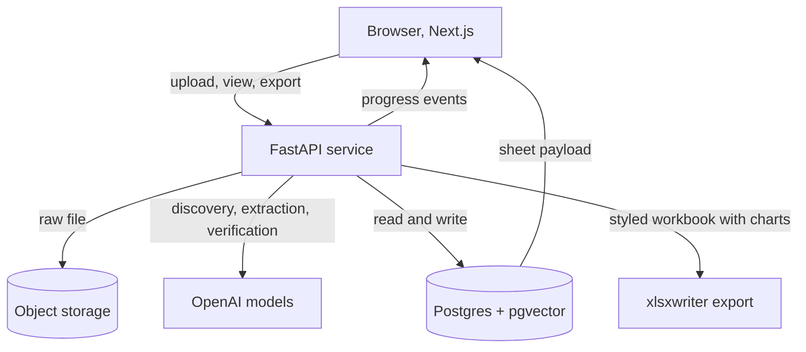

# Build Plan: IB Desk

This document is the source of truth for the build, the blueprint. Keep it in the repo root next to `CLAUDE.md`. The companion file `CLAUDE.md` holds the principles and conventions. Each phase below has an acceptance bar. Do not advance until it is met.

## What we are building

A user uploads a research document about anything: a company, a market, a person, a technology, or a deal. IB Desk understands what the document is about, discovers the right structure for it, extracts as much grounded data as possible, including well-summarized qualitative insight, and renders it as one clean, dynamic spreadsheet. The user downloads a styled, editable xlsx that looks as good as the screen. One sheet is created per document. Documents are never merged.

## Core design principles

1. The schema is discovered, not hardcoded. The code never assumes the document is about a company.
2. Content determinism. The same document must yield the same set of relevant data and the same values across runs. Section ordering and visual positioning may vary. The data and values may not.
3. Exhaustive and general. Capture everything useful, structured or qualitative. Important narrative is summarized into clean insight sections, not dropped because it is not a number.
4. Every extracted value is grounded: it carries the exact source sentence, a character span into the source text, and a confidence score. If it is not supported by the source, it does not appear.
5. Never fabricate. When support is weak, omit or flag with low confidence. A single invented figure destroys trust.
6. One document maps to exactly one sheet. No cross-document merging.
7. Export fidelity is achieved server-side, where cell styling and native charts are possible.
8. Storage is generic and tidy. The user interface and the export are derived from the stored schema, not the other way around.

## Tech stack

Web app: Next.js with TypeScript, React, Tailwind for layout, a data grid (TanStack Table headless, or a custom grid), recharts for in-app charts.
Extraction service: Python, FastAPI, async. Talks to OpenAI for discovery, extraction, verification. Generates exports with xlsxwriter.
Database: Supabase Postgres. pgvector column reserved on documents for future similar-sheet search, forward looking, not load bearing in v1.
Object storage: Supabase Storage or S3 for raw uploaded files.
Deploy: web on Vercel, service on Railway or Fly, database on Supabase.
Models: a flagship OpenAI reasoning model for discovery and extraction, a cheaper model for verification. Exact model strings to be confirmed by the project owner. Use structured outputs (JSON schema or function calling) for every call so JSON is reliable.

## Architecture



## Data model (generic, schema-agnostic)

The schema discovered for each document is stored as data in `sections` and `cells`. No table is named after a business concept.

```sql
create table documents (
  id uuid primary key default gen_random_uuid(),
  workspace_id uuid not null,
  name text not null,
  source_kind text not null,            -- upload_pdf | upload_docx | paste
  raw_text text not null,               -- normalized plain text
  byte_path text,                       -- object storage key for the original file
  doc_type text,                        -- discovered: company_profile | market_overview | deal | person | technology | other
  primary_topic text,                   -- discovered, free text
  embedding vector(1536),               -- reserved for future similar-sheet search
  created_at timestamptz default now()
);

create table sheets (
  id uuid primary key default gen_random_uuid(),
  document_id uuid not null references documents(id) unique,
  title text not null,                  -- usually the primary subject label
  status text not null default 'idle',  -- idle | extracting | done | failed
  field_count int default 0,
  cost_usd numeric default 0,
  created_at timestamptz default now()
);

create table sections (
  id uuid primary key default gen_random_uuid(),
  sheet_id uuid not null references sheets(id) on delete cascade,
  key text not null,                    -- machine key, e.g. investors_capital
  label text not null,                  -- human label, e.g. Investors and capital
  kind text not null,                   -- scalar | list | table | timeseries | longtext
  render_hint text not null,            -- see RenderHint enum below
  category text,                        -- soft color category for the UI and export
  columns jsonb,                        -- for table or timeseries: ordered column defs
  sort int not null,
  confidence real
);

create table cells (
  id uuid primary key default gen_random_uuid(),
  section_id uuid not null references sections(id) on delete cascade,
  row_idx int not null default 0,
  col_key text,                         -- null for scalar and longtext
  value_raw text,                       -- exactly as written in the document
  value_norm text,                      -- normalized (number, percent, currency)
  unit text,                            -- e.g. INR, percent
  period text,                          -- e.g. FY24
  source_snippet text not null,         -- the sentence that supports this value
  char_start int,                       -- span into documents.raw_text for highlighting
  char_end int,
  confidence real
);

create table extraction_events (
  id uuid primary key default gen_random_uuid(),
  sheet_id uuid not null references sheets(id) on delete cascade,
  stage text not null,                  -- discovery | extraction | verification | typing | done | error
  message text,
  payload jsonb,
  created_at timestamptz default now()
);
```

Row level security on `documents`, `sheets`, `sections`, `cells` scoped by workspace. This matters later because the data is finance research.

## Extraction contracts

Pass 1, discovery. Input: full `raw_text`. Output:

```json
{
  "doc_type": "company_profile",
  "primary_topic": "Meridian Freight Systems, a cloud TMS vendor",
  "primary_subject": {
    "label": "Meridian Freight Systems",
    "identity_fields": [
      { "key": "founded", "label": "Founded", "value": "2017", "source": "...", "confidence": 0.95 }
    ]
  },
  "sections": [
    {
      "key": "investors_capital",
      "label": "Investors and capital",
      "kind": "table",
      "render_hint": "table",
      "category": "capital",
      "columns": [
        { "key": "name", "label": "Investor" },
        { "key": "round", "label": "Round" },
        { "key": "amount", "label": "Amount" }
      ],
      "rationale": "the document names multiple investors with rounds and ticket sizes"
    }
  ]
}
```

Pass 2, extraction, run once per section in parallel. Input: `raw_text` plus one section definition. Output:

```json
{
  "section_key": "investors_capital",
  "rows": [
    {
      "row_idx": 0,
      "cells": [
        { "col_key": "name", "value_raw": "Elevation Capital", "value_norm": "Elevation Capital", "source_snippet": "In 2023 Meridian closed a Series B led by Elevation Capital.", "char_start": 4120, "char_end": 4188, "confidence": 0.95 },
        { "col_key": "amount", "value_raw": "$24M", "value_norm": "24000000", "unit": "USD", "period": "2023", "source_snippet": "...closed a 24 million dollar Series B...", "char_start": 4090, "char_end": 4140, "confidence": 0.92 }
      ]
    }
  ]
}
```

Pass 3, verification. For each cell, confirm the `source_snippet` actually supports `value_raw`. Drop or flag cells that fail. Can be a cheaper model or a rule plus model hybrid. Records a `fabrication_flag` where grounding is weak.

Pass 4, render typing. Assign each section a `render_hint`:

```
RenderHint =
  keyvalue       // scalar fields shown as label and value
  chips          // a flat list of short entities
  table          // rows and columns
  timeseries_bar // numeric values across periods, bar chart plus table
  timeseries_line// numeric values across periods, line chart plus table
  breakdown_pie  // parts of a whole, pie chart plus table
  longtext       // a summary paragraph
```

Chart rule: only emit a chart hint when a section is numeric and temporal, or a parts-of-whole breakdown with at least three points. Otherwise no chart. This avoids misleading auto-charts. The user can toggle a chart off in the UI.

## API contract

```
POST /v1/documents            multipart file or pasted text -> { document_id, sheet_id }
GET  /v1/documents            -> list of documents for the workspace
GET  /v1/sheets/{id}          -> full payload: sheet, sections, cells, source spans
POST /v1/sheets/{id}/extract  -> starts the pipeline, returns immediately
GET  /v1/sheets/{id}/events   -> server sent events stream of extraction_events
GET  /v1/sheets/{id}/export   -> ?format=xlsx (default) | pdf | csv, returns the styled file
```

Progress streaming uses SSE from FastAPI, or Supabase Realtime on `extraction_events`. The UI shows the gradual reveal off these events.

## The extraction pipeline in detail

Synchronous for documents that fit in the model context, which covers the 20 to 40 page research docs in scope. For larger documents, add a chunk and merge fallback in Phase 5.

- Discovery: one call, low temperature, structured output. Keep a soft taxonomy of common section types in the prompt so the model maps into stable keys rather than inventing wildly different keys for the same concept across runs. The taxonomy is a guide, not a constraint. The model may add new sections, including qualitative insight sections, not only numeric ones.
- Extraction: parallel per section with a concurrency limit and exponential backoff on rate limits. Per-section error isolation so one failure does not halt the sheet. Instruct for exhaustiveness: extract every instance present, summarize important narrative into clean prose, do not drop qualitative value.
- Verification: catches fabrication, which is the failure that destroys banker trust. A value with no supporting snippet is dropped, not shown.
- Typing: cheap, mostly deterministic given the cells, with the chart rule above.
- Cost tracking: accumulate token cost per call into `sheets.cost_usd`. Emit an event per stage for the progress UI.

## Rendering, dynamic UI

The frontend reads `sections` and renders each by `render_hint`, with no knowledge of business concepts:

- keyvalue and longtext: text blocks.
- chips and table: the grid and chip components, with a confidence dot per value.
- timeseries and breakdown: a recharts chart plus the underlying table, with a toggle.
- Every value is clickable. Clicking opens the evidence drawer showing the `source_snippet` and, in Phase 4, highlights the span in a preview of the original document using `char_start` and `char_end`.
- Color comes from `category`. Confidence comes from the cell `confidence`. One sheet tab per document.

## Export, styled xlsx

Server-side with xlsxwriter:

- Title block merged and styled. Section header rows filled with the category color, bold white text.
- Sub-tables with styled header rows and banded rows. Rupee and percent number formats applied to `value_norm` with `unit`.
- Native embedded charts for sections whose `render_hint` is a chart type, using the same series the UI shows.
- Freeze the header. Sensible column widths.
- The downloaded file reflects the visual sheet, never the internal tidy rows. pdf and csv are secondary formats.

## Evaluation

Build a golden set of at least eight documents spanning different `doc_type` values: company, market overview, deal, person, technology, and two messy or ambiguous ones. Metrics:

- Schema sensibleness: human rating of whether the discovered sections fit the document.
- Field precision and recall against hand-labeled values.
- Grounding faithfulness: share of values whose snippet truly supports them.
- Fabrication rate: share of values with no real support. Target near zero.
- Schema stability: variance of the discovered schema across repeated runs of the same document.

Run the evals in CI. Any prompt change must pass the bar before merge.

## Phases

### Phase 0: Repo and foundations
Goal: an empty but fully wired skeleton that deploys.
Deliverables: monorepo layout below, web and service scaffolds, Supabase project, env and secret handling, CI with lint and test, the full database migration above, a health endpoint, a CLAUDE.md with conventions.
Interfaces introduced: the data model migration, the API route stubs.
Acceptance: web loads, service health is green, database is migrated, one end to end request path returns a stub sheet.

```
ib-desk/
  apps/web/          # Next.js
  services/api/      # FastAPI
  packages/shared/   # shared TypeScript types for the sheet payload
  db/migrations/
  evals/             # golden docs and the harness
  CLAUDE.md
  BUILD_PLAN.md
```

### Phase 1: Ingestion and document store
Goal: get any document into the system as clean text.
Deliverables: upload and paste intake, PDF and DOCX parsing to normalized text (pdfplumber or unstructured for PDF, python-docx for DOCX), raw file saved to object storage, text saved to `documents`, the sidebar document list and selection, empty and loading states.
Interfaces introduced: POST /v1/documents, GET /v1/documents.
Acceptance: upload a real PDF and a real DOCX, both appear in the sidebar, clean text is stored, the original is retrievable.

### Phase 2: Schema-agnostic extraction engine
Goal: prove the core works across very different documents.
Deliverables: the four-pass pipeline, the discovery and extraction JSON contracts, persistence into `sections` and `cells`, per-section parallelism with backoff and error isolation, cost tracking, the SSE events stream, and the eval harness with the golden set.
Interfaces introduced: POST /v1/sheets/{id}/extract, GET /v1/sheets/{id}/events, the discovery and extraction schemas, the RenderHint enum.
Acceptance: feed three structurally different documents and get three sensible, distinct schemas with grounded data. Eval metrics meet the bar. Fabrication rate near zero.

### Phase 3: Dynamic spreadsheet UI
Goal: render any discovered schema beautifully and dynamically.
Deliverables: the generic section renderers, the grid, chip lists, summary blocks, recharts charts driven by render hints, the gradual reveal animation off the events stream, color-coded confidence markers, the click to evidence drawer, the per-document sheet tab and history.
Interfaces introduced: GET /v1/sheets/{id} full payload, the shared TypeScript types.
Acceptance: a real extracted document renders as a clean dynamic sheet, charts appear only where warranted, evidence works on every value.

### Phase 4: Styled export and document-grounded evidence
Goal: the download looks as good as the screen, and evidence ties back to the original.
Deliverables: the xlsxwriter export with colors, number formats, banded tables, merged title, freeze panes, and native embedded charts. A source document preview pane that highlights the exact span on cell click using char offsets. csv and pdf as secondary formats.
Interfaces introduced: GET /v1/sheets/{id}/export.
Acceptance: the downloaded xlsx opens cleanly in Excel, is styled and colored, contains native charts, and is editable. Clicking a cell highlights the supporting sentence in the original document.

### Phase 5: Hardening and end to end
Goal: a production-ready product.
Deliverables: authentication and per-workspace authorization via Supabase, persistence of sheets and history, comprehensive empty, loading, and error states, observability with structured logging and tracing and evals in CI, rate limiting, a security pass for finance data confidentiality, a large-document chunk and merge fallback, and a polished demo flow.
Acceptance: a new user signs up, uploads any document, gets a dynamic structured sheet with charts, downloads a beautiful xlsx, reopens past sheets, and the system fails gracefully when a document is unparseable or a model call errors.

## Open risks and decisions to confirm

- Schema stability: discovery can vary run to run. Mitigate with low temperature, a soft section taxonomy, and a stable prompt. Measure variance in evals. A model at temperature zero is near-deterministic, not perfectly guaranteed, so normalization and verification carry the burden of value consistency.
- Chart correctness: auto-generated charts can mislead. The chart rule is conservative and the user can toggle charts off. Verify the rule on real data.
- Parsing messy PDFs: scanned or badly laid out PDFs are their own hard problem. Decide early whether to add OCR.
- Cost: four passes with per-section parallelism uses more tokens. Track per-sheet cost and consider a cheaper model for verification and typing.
- Confidentiality: this is finance research. Decide data retention, encryption, and whether documents may be sent to a third-party model at all, before any real client data is loaded.
- Model selection: confirm the exact OpenAI models for each pass.
